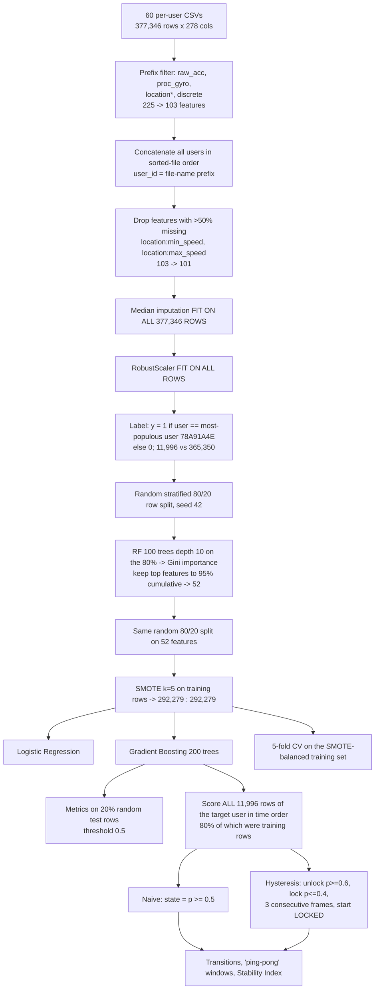

# ORIGINAL PIPELINE RECONSTRUCTION (Stage 1 — Phase 1)

**Source of truth:** `experiment_Files/COMPLETE_ExtraSensory_Analysis_with_Hysteresis.ipynb` (executed; cell numbers below refer to it).
**Method:** line-by-line reading of the executed code and its saved outputs, then independent re-execution (see `ORIGINAL_RESULTS_REPRODUCTION.md`). Where the written documents (`Partial_fulfilment.docx`, coursework exams) describe something different, the code is taken as what was actually done.

---

## 1. Pipeline as executed

## 2. Step-by-step detail

| # | Cell | What the code does | Consequence |
|---|---|---|---|
| 1 | 7–8 | `sorted(glob(...*.csv))`; `feature_cols` = 225 non-label columns of the first file | — |
| 2 | 11–13 | Per-user row count, span `(max−min timestamp)/3600`, file size, mean NaN %. Table 1 hard-codes the string **"20-second windows"** as temporal resolution | 20 s is not computed anywhere; see `DATASET_TEMPORAL_AUDIT.md` |
| 3 | 18 | Keeps features whose name starts with `raw_acc`, `proc_gyro`, `location` (also matches `location_quick_features`) or `discrete` → 103. Excludes magnetometer, watch, audio, `lf_measurements` | Magnetometer and audio — the modalities named in the original RQ — are **not used**. Watch data are **not used** |
| 4 | 20–21 | Drops 2 features >50% missing → 101. `SimpleImputer(median)` and `RobustScaler` are **fit on the full pooled dataset** | Train/test statistics shared (preprocessing leakage; small for median/IQR, but not zero) |
| 5 | 23 | `target_user = value_counts().index[0]`; `y = (user_id == target_user)` | **One** binary one-vs-rest problem for **one** user. The other 59 users are the negative class |
| 6 | 26 | `train_test_split(test_size=0.2, stratify=y, random_state=42)` on **rows**; RF for importance on the 80% | Rows 1 minute apart from the same session fall on both sides |
| 7 | 28 | Cumulative Gini importance ≥ 0.95 → **52** features | The feature list is fixed with knowledge of the label, using the same split later used for testing (test rows not used by the RF, so no direct test leakage here) |
| 8 | 32 | Same split (verified identical indices), SMOTE on training rows only | SMOTE applied after the split — correct |
| 9 | 34 | LR `C=1, lbfgs, max_iter=1000, class_weight='balanced'` on the SMOTE data | lbfgs does not converge (warning suppressed by `warnings.filterwarnings('ignore')`) |
| 10 | 36 | GB `n_estimators=200, lr=0.1, max_depth=6, min_samples_split=100, min_samples_leaf=50, subsample=0.8, max_features='sqrt', random_state=42` | Hyperparameters fixed by hand; no tuning, no validation set |
| 11 | 42 | Takes **all** 11,996 rows of the target user, sorts by timestamp, applies the fitted imputer/scaler/features | This stream is ~80% **training data** |
| 12 | 44 | `naive = p >= 0.5`; transitions = Σ\|Δstate\|; "ping-pong episodes" = number of **overlapping** 4-frame windows containing ≥2 transitions | 567 is a window count, not an episode count. It explains the 597/567 "impossibility" flagged by the previous audit |
| 13 | 46 | State machine (reproduced verbatim in `reproduce_original.py`): initial state LOCKED; from LOCKED, unlock after the 3rd consecutive frame with p≥0.6; from UNLOCKED, lock after the 3rd consecutive frame with p≤0.4. Prints "TTT: 3 frames (60s)" (assumes 20-s frames) | Actual TTT ≈ **3 minutes** (median frame gap 60 s) |
| 14 | 50 | Stability Index = 1 − transitions / (frames − 1) | Algebraically identical to 1 − transition rate; not an independent metric |
| 15 | 53 | Accuracy, precision, recall, F1, FAR, FRR, ROC-AUC on the 20% test rows at threshold 0.5. **"EER" = (FAR+FRR)/2** | Not an equal error rate. True EER (from ROC) = 2.64% for GB, not 3.81% |
| 16 | 57 | 5-fold CV on `X_train_balanced` (contains SMOTE synthetic rows) | Synthetic neighbours of validation points leak across folds; CV score is optimistic |
| 17 | — | **No** metric (accuracy, FAR, FRR) is computed after hysteresis. **No** impostor stream is ever passed through naive or hysteresis logic | Hysteresis is evaluated only on genuine-user frames |

## 3. What the pipeline did, in one paragraph

It trained a single pooled binary classifier to tell whether a one-minute ExtraSensory example came from participant `78A91A4E` (the participant with the most data) or from any of the other 59 participants, using randomly split rows, and then replayed that participant's *entire* timeline (mostly training rows) through the classifier and through two decision rules, counting how often the resulting lock/unlock state changed.

## 4. Discrepancies between the written reports and the executed code

Not silently corrected — each is listed so you can decide how to handle it.

| # | Claim in `Partial_fulfilment.docx` (unless noted) | What the code actually does | Severity |
|---|---|---|---|
| D1 | "For each user, data was split chronologically: 60% train / 20% validation / 20% test" | Pooled, random, stratified **80/20** row split; **no validation set**; not per user | **Critical** |
| D2 | "Two supervised learning models were trained to predict user identity" | One-vs-rest detector for **one** user | **Critical** |
| D3 | "Missing sensor readings were handled via median imputation **within each user's data**" | Global median, fit on all users and all rows | High |
| D4 | "Windows with >50% missing data were excluded (affecting <2% of frames)" | No row exclusion exists. Two **features** with >50% missing were dropped | High |
| D5 | "From the original 225 features, we selected 52 features that account for 95% of total information gain" | 225 → 103 by manual sensor-prefix choice → 101 → 52 by **Gini (MDI)** importance on 101. Coursework text also says "53-feature set" | Medium |
| D6 | "TTT = 3 seconds" (RQ3) | `TTT_FRAMES = 3`; code prints 60 s; real ≈ 180 s | **Critical** |
| D7 | "Oscillation Episodes (≥3 transitions/min)"; "Ping-Pong Frequency: number of state toggles within a 1-minute window" | Count of overlapping 4-frame (~4-min) windows with ≥2 transitions | High |
| D8 | "567 oscillation episodes **across all test users**"; "~5 transitions per user to <1 per user" | One user; 597 transitions all belong to that user | **Critical** |
| D9 | Table 5: Accuracy/FAR/FRR "Baseline = Hysteresis, change 0.0%" | Never computed. Values were copied from the test-set evaluation. Measured on the same genuine stream, rejected-frame rate falls 4.31% → 2.03% (test rows: 7.09% → 2.29%) — **it does change**. Post-hysteresis FAR was never measurable because no impostor stream exists | **Critical** |
| D10 | "Stability Index: ratio of stable frames to total frames" | 1 − transitions/frames | Medium |
| D11 | "EER 3.81%" | (FAR+FRR)/2 at τ = 0.5. True EER 2.64% | Medium |
| D12 | "Temporal split simulates realistic deployment where the model must generalize to future behaviour" | No temporal split exists | **Critical** |
| D13 | "Demonstrate generalizability … compatible with multiple classifier architectures" (Objective 5) | Hysteresis applied only to GB | Medium |
| D14 | "20-second sampling interval" (all documents) | 20 s is the recording *duration*; examples are ~1 per minute | High |
| D15 | Coursework: "15.3% of records lacking Watch Accelerometer data" | Not computed in any notebook. In the data, 35.1% of rows (pooled) have all watch-acceleration features missing. Watch features were not used by the model anyway | Low (for the RQ) |
| D16 | Coursework: "ingestion time ≈45 s"; "pd.concat would hit a hard memory ceiling at ≈600 users" | Notebooks show 59.33 s (stats pass) and 11.13 s (selected-column load); the 600-user stress test loaded all 600 frames and its output ends before the concatenation result is printed. The ceiling is NOT ESTABLISHED FROM AVAILABLE EVIDENCE | Low |
| D17 | Coursework: "A NVIDIA Tesla T4 GPU runtime was used" as a solution | scikit-learn estimators used here run on CPU only; the GPU had no effect | Low |
| D18 | Methodological critique PDF: within-subjects human study, 70/60 thresholds, 65% baseline, light sensor, on-device app | Nothing in the repository implements or records this study | **Critical** (if still cited) |
| D19 | `extraSensoryDataset.ipynb` figure "Your Novel Approach (Flickers…)" | Synthetic Gaussian data, not ExtraSensory | Medium (if used as evidence) |
| D20 | Coursework: "Standard classifiers like SVMs, Random Forests cannot natively handle dynamic feature absence" | Not tested; pipeline imputes before any classifier | Low |

Items that **do** match the code: LR accuracy 74.54% and training time 152.60 s; GB accuracy 99.26%, precision 0.8524, recall 0.9291, F1 0.8891, FAR 0.53%, FRR 7.09%, ROC-AUC 0.9976, training time 741.87 s; 597 → 49 transitions; 567 → 0 "episodes"; Stability Index 0.9502 → 0.9959; 1:30.5 imbalance; 101 features after dropping two; 72.3% missingness of the speed features; 377,346 rows; 16.5% mean missingness.
