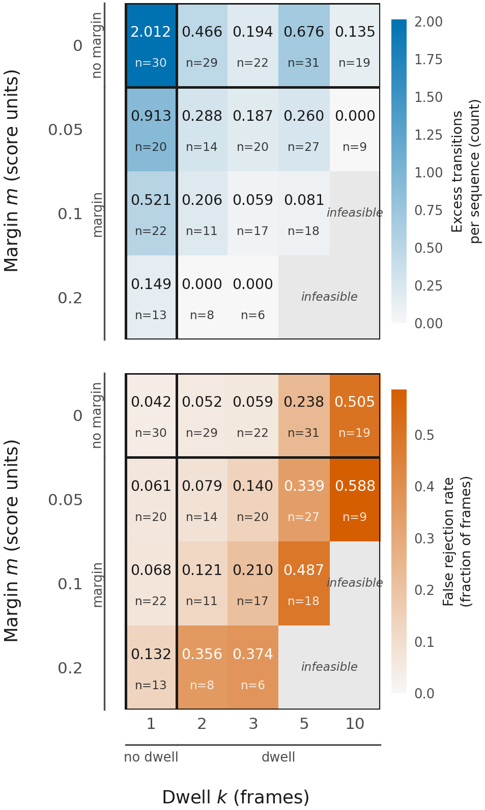
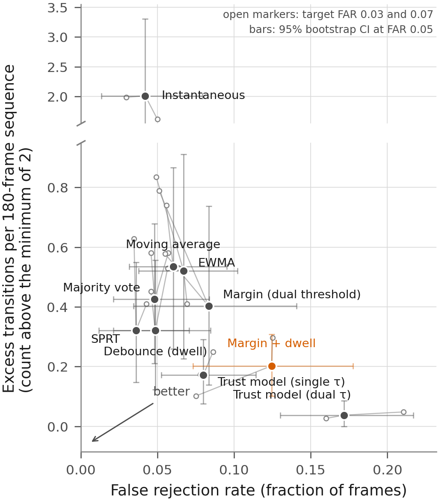
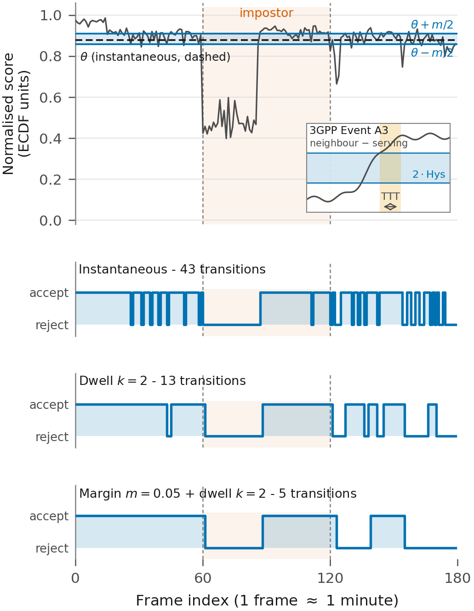
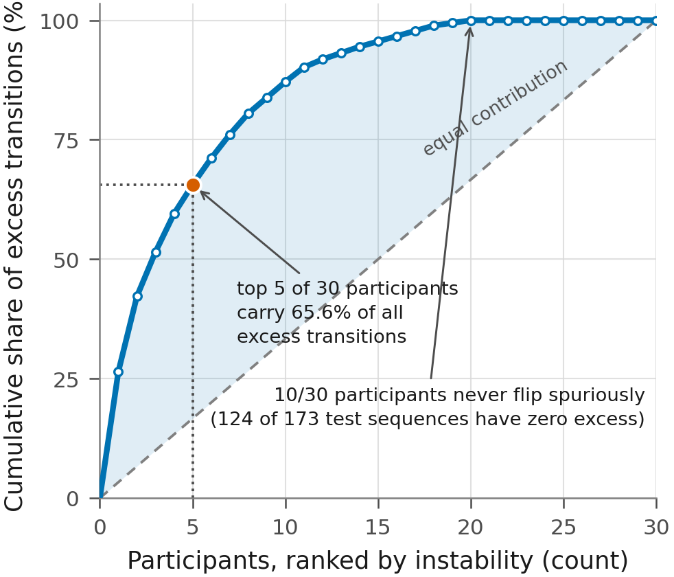
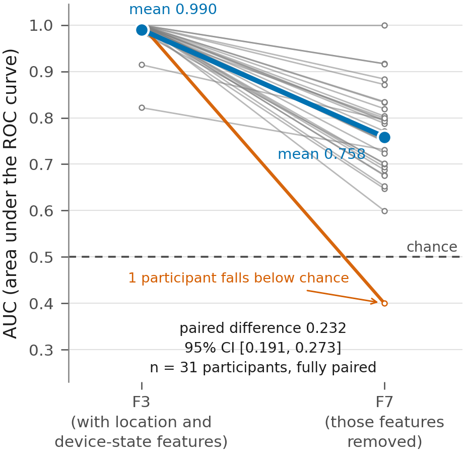

# Paper figures — Stage 2

Figures and the post-hoc table for *Does the Handover Margin Earn Its Place? A Factorial
Comparison of Temporal Decision Policies for Context-Based Continuous Smartphone
Authentication*.

Everything here is derived from the frozen Stage 2 results. **No script in this directory
writes to `experiment_Files/Stage2/results/`, refits a model, or regenerates a score
dump** — they read CSV and JSON only. Rebuild the lot with:

```bash
./build.sh            # everything
./build.sh fig3       # just the scripts matching "fig3"
```

## Layout

| Path | What is in it |
|---|---|
| `scripts/` | one script per figure, plus `_style.py` (shared palette, layout guard, paths) |
| `rendered/` | the deliverables — a 300 dpi PNG and a vector PDF per figure, same stem |
| `checks/` | one JSON per figure recording every number drawn and what it was checked against |
| `posthoc/` | the post-hoc paired descriptives: `POSTHOC.md`, two CSVs, and `provenance.json` |
| `CAPTIONS.md` | the caption for each figure, ready to paste into the paper |
| `CHECKS.md` | every checked number in one table, plus the two layout findings |

Paths inside the scripts are derived from `__file__`, so they run from any working
directory. `rendered/` keeps the PNG and the PDF of a figure under the same stem, so
LaTeX picks the PDF automatically from `\includegraphics{fig1_factorial_surface}` with
`\graphicspath{{docs/Stage2/figures/rendered/}}`.

The citation verification that was produced alongside these lives one level up, next to
the other literature work: [`../CITATIONS_VERIFIED.md`](../CITATIONS_VERIFIED.md).

## The figures

| | Figure | Source under `analysis/` |
|---|---|---|
| 1 | **Factorial response surface at FAR 0.05.** Margin × dwell, excess transitions and FRR, every cell annotated with its value and its participant count. Cells are *not* paired. | `factorial/response_surface.csv` |
| 2 | **Stability–lockout plane.** One marker per mechanism at FAR 0.05 with 95% CIs on both axes, and faint trails to the FAR 0.03 and 0.07 calibrations. | `families/mechanism_metrics.csv`, `secondary/far_0.0{3,7}/mechanism_metrics.csv` |
| 3 | **Concentration of instability.** Lorenz-style: the top 5 of 30 participants carry 65.6% of all excess transitions, and 10 of 30 never flip spuriously. | `families/sequence_metrics.csv` |
| 4 | **Score validity, F3 vs F7.** Paired slope chart; mean AUC 0.990 → 0.758 when the location and device-state features are removed. | `secondary/score_validity_f3_f7.csv`, `secondary/score_validity_summary.json` |
| 5 | **One sequence under three policies** (optional), with the 3GPP Event A3 inset. States come from the frozen `src/decision_v2.py`, not reimplemented here. | `f3/scores/7CE37510.parquet`, `factorial/operating_points.csv` |

<p align="center">
  
  
  
</p>
<p align="center">
  
  
</p>

## Conventions

- matplotlib only; 300 dpi PNG plus vector PDF with TrueType fonts embedded
  (`pdf.fonttype 42`).
- Okabe–Ito colour-blind-safe palette. Sequential encodings are single-hue, light to
  dark — never a rainbow ramp, which would imply category boundaries the data does not
  have.
- No titles inside the images; captions live in `CAPTIONS.md`. Axis labels carry units.
  Every figure fits a single column of about 8.5 cm.
- The composed cell with both a margin and a dwell is always called **"margin + dwell"**,
  never "hysteresis": in 3GPP Event A3, hysteresis is the margin term alone and
  time-to-trigger is a separate dwell term.
- `_style.save()` measures the drawn artists against the canvas and **aborts** rather
  than writing a figure whose labels would be cut. `bbox_inches='tight'` can only crop,
  never extend, and `Figure.get_tightbbox` does not detect the overflow because it
  intersects with the canvas — so this has to be measured explicitly. See `CHECKS.md`.

## Reproducibility

Each script prints the numbers it drew and writes them to `checks/<stem>_checks.json`;
`CHECKS.md` collects them with what each was checked against. Figure 3's three annotated
numbers are hard gates — the script refuses to draw if any stops reproducing. The
post-hoc bootstrap uses seed 20260918 with 2,000 participant-level resamples and the
project's own `src.decision_v2.bootstrap_mean_ci`, so `posthoc/` regenerates exactly.
